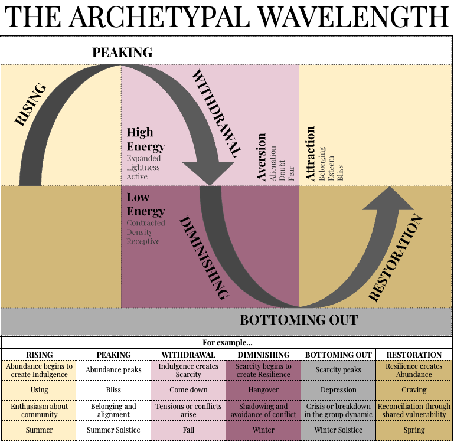

## The Mode of the Wavelength of Purple: Inhabit (Feel)

The Mode of the Wavelength of Purple is Inhabit (Feel).

Where Beige was about Doing—hunting, gathering, protecting, controlling—Purple shifts the lens inward, toward Feeling.
This is the first explicitly Divine Feminine Stage in APTITUDE, and it is through this lens that we encounter the Archetypal Wavelength not as a cycle of effort or exertion, but as a mood—an energetic wave that passes through us, that we learn to feel, not fix.

If you’ve been tracking the structure of APTITUDE so far, you’ll know that each Stage explores a different mode of this six-phase Wavelength. These phases—Rising, Peaking, Withdrawal, Diminishing, Bottoming Out, and Restoration—are the fundamental shape of every cycle: birth, death, rebirth. Action, collapse, renewal. This pattern is everywhere: in your energy levels, your creative projects, your relationships, your seasons, your breath.

In this chapter, you’ll find the Archetypal Wavelength graphic—an elegant, looping sine wave that captures the rise and fall of human experience. If you haven’t already, take a moment to really sit with that image. Let it imprint. You’ll see it again and again throughout APTITUDE, and it will start to become a kind of intuitive map you can overlay onto any moment of your life.

Purple gives us a new vantage point from which to view this cycle: not as something we do, but as something we feel through. We call it the Inhabit (Feel) expression.

To feel through the Wavelength is to develop a kind of emotional literacy—not just with your own feelings, but with the vibrational field you move through. You begin to track your shifts. To notice when you’re Rising. To sense when you’re Peaking. To receive the somatic weather of your own psyche instead of trying to outthink or override it.

This internal awareness becomes especially crucial in the bottom half of the wave—where the tendency is to label experience as “bad” or “wrong” and to scramble back toward the Peak. But what if the Diminishing, the Bottoming Out, the stillness at the bottom of the exhale… what if all that wasn’t failure? What if it was part of the sacred cycle?

In fact, the Purple version of the Wavelength teaches exactly that. As depicted in the “Inhabit (Feel)” PDF from your materials, each of the six phases has its own energetic signature, both in its healing “prescribed” dosage and its toxic “overdose” form.
Let’s just preview them here:

Rising Rx: Inspiration — Guided by subtle symbols, dreams, or intuitive nudges.
OD: Grandiosity — Mistaking inspiration for spiritual superiority or specialness.

Peaking Rx: Joy — The full crescendo of feeling, in sync with symbols and unseen rhythms.
OD: Ecstasy — Overwhelmed by meaning, chasing mystical highs.

Withdrawal Rx: Introspectivity — Quiet inner reflection and gentle emotional processing.
OD: Anxiety — Flooded by feelings, uncertain what’s real.

Diminishing Rx: Tranquility — Soft retreat into comfort, nesting, and gentle beauty.
OD: Self-Doubt — Losing confidence, questioning intuition and worth.

Bottoming Out Rx: Convalescence — Restful emptiness, receptive to future renewal.
OD: Self-Loathing — Turning symbolic failure inward as shame.

Restoration Rx: Recuperation — Energy slowly returns; meaning begins to glimmer again.
OD: Selfishness — Hoarding vitality instead of rejoining the collective vibe.

We’ll go into each of these in more detail later, but for now, just notice the language. These are feelings. Moods.
Atmospheres of the soul. And in Purple, your task is not to fix or force them—but to receive them. To feel them without becoming them. To notice the shape of your internal weather, and let it move through.

This is what it means to Inhabit the Wavelength.
You become sensitive to your own vibration. You stop trying to brute-force your mood into compliance. And in that sensitivity, you discover that you are more than the mood. That your feelings, like the Archetypal Wavelength itself, are sacred. Cyclical. Temporary.
Meaningful.

When you allow yourself to feel without flinching, you begin to recognize: even your sadness has rhythm. Even your despair has a pulse. And beneath that pulse, always, is Source.

We are not always meant to climb. Sometimes we are meant to curl inward. To nest. To sense. To feel.

Purple is where you learn to surf the wave—not through strength, but through sensitivity.
