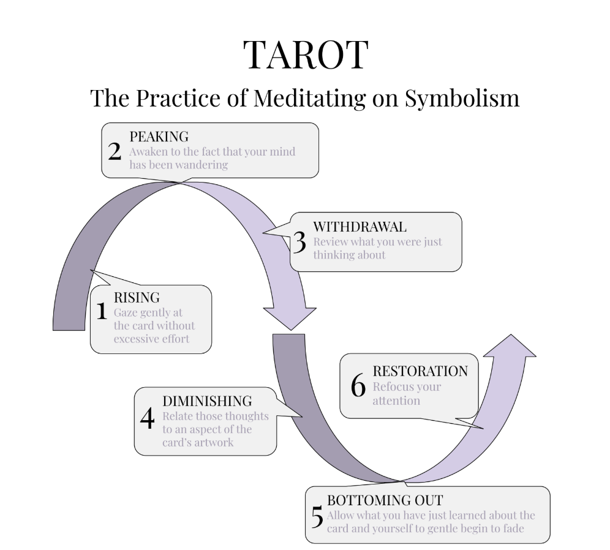

## The Practice of Purple: A Daily Tarot Draw

The Practice of Purple is a daily meditation on symbolism, most often expressed through the Tarot. Each morning (or whenever you feel called), you’re invited to draw a card from the Major Arcana and sit with it for five minutes, allowing its imagery, archetypal tone, and symbolic resonance to steep into your consciousness like tea leaves unfurling in hot water.

The recommended pattern—offered, not mandated—is to work through the 22 cards of the Major Arcana in sequence, one per day.
You begin with The Fool on Day 1 of this Stage and conclude with The World on Day 22, the first day of Red. This gives you a structured encounter with the Fool’s Journey: the arc of psychic evolution encoded in Tarot lore. But if a random draw feels more alive for you, follow that feeling. If you prefer Bibliomancy, the I Ching, Runes, or simply sitting with a symbol you encountered on your morning walk, beautiful.
This is your journey.

What matters most is how you engage the symbol. The image in this section illustrates the Wavelength of Purple Practice—not just the what, but the how, the rhythm of feeling-into-symbol that aligns with the Inhabit (Feel) current of this Stage. Here’s how it flows:

Rising: Gaze gently at the card. Don’t over-focus or try to decode anything. Let the image wash over you like warm water.
Allow yourself to receive the card, without reaching for it.

Peaking: At some point, your mind will wander.
Perfect. This is the moment of awakening. You realize: “Oh—I’ve been thinking.” That’s not failure. That’s the bell of awareness ringing.

Withdrawal: Now review what you were just thinking about. Trace it back. Was it a memory? An anxiety? A hope? This is what your mind wanted to show you when your guard was down.

Diminishing: Gently relate those thoughts to the artwork. Is there a thread? A symbolic bridge? Perhaps the card’s imagery reflects your wandering in an unexpected way. Let the connection be felt more than reasoned.

Bottoming Out: Allow what you’ve just discovered—about the card, about yourself—to gently fade. Let it dissolve without clutching. Let the meanings be mist. Let it go.

Restoration: Finally, refocus your attention. Take one last look at the card’s image. Then, if you wish, look up the traditional interpretation. Notice: do the meanings overlap with your impressions? Do they conflict? Is there a new nuance you missed? This final step is not about confirmation, but curiosity.

This practice isn’t about being “right.” It’s not about mastering esoteric knowledge or performing spiritual correctness.
It’s about cultivating the subtle art of receptivity—learning to listen symbolically, emotionally, somatically. To let meaning emerge rather than impose it.

And crucially: this is not the only way. APTITUDE is a map, not a prescription. You are not being led—you are choosing to walk. I am not your guru. You are your own guide. Tarot is just one trailhead into the forest of archetype, intuition, and mythic resonance.
There are others. Many others. We’ll explore more later.

But for now, try this: one card. Five minutes. A gentle wave of attention. A soft Yes to the sacred.

It’s amazing what can be revealed in the space you’re willing to receive.
