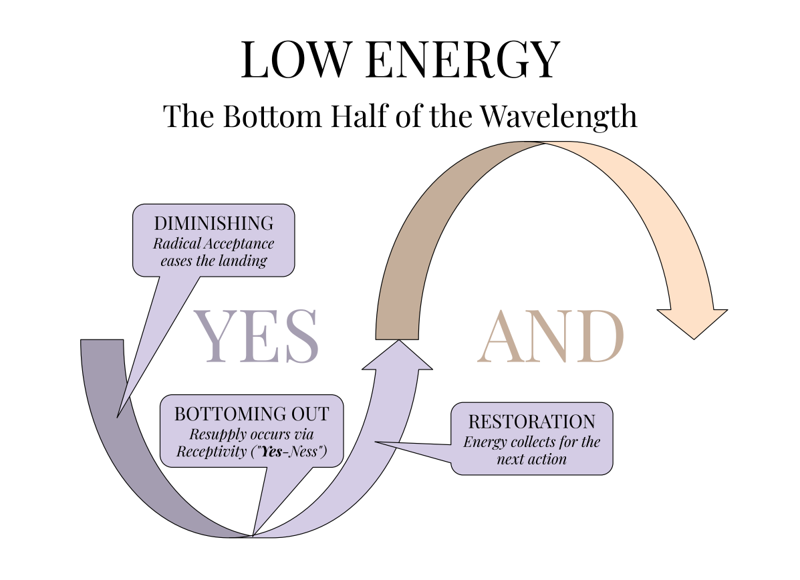
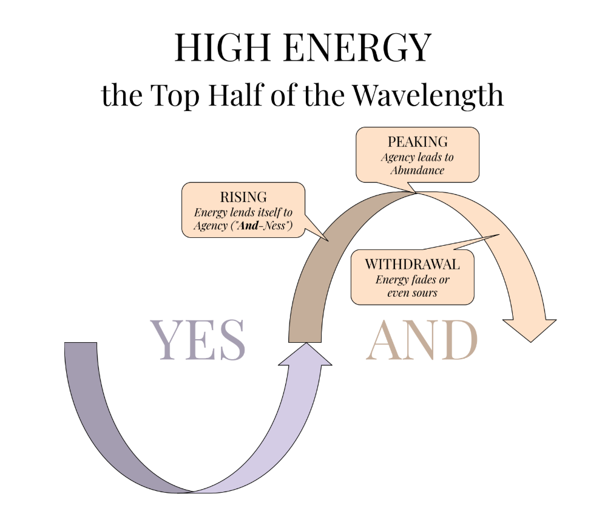

## Yes-And-Ness: A balance between Radical Agency and Radical Acceptance

Tara Brach’s Buddhism-inspired practice of Radical Acceptance—resolutely accepting reality as it is, without wishing it were different, regardless of the situation—is a fantastic philosophy for about 95% of human experience. In one lecture, Brach quotes a Buddhist nun who attempts to meet every circumstance with the words: “Thank you for this experience, I have no complaints.”

I love that sentence. On an ordinary Tuesday—stuck in traffic, passed over for something I wanted, rained on without an umbrella—it can dissolve an hour of suffering in a single breath. Pain is inevitable, and accepting pain really does have the potential to nix the extra suffering we generate through resistance and attachment.

But we know intuitively that those words can’t be rightly applied to *every* circumstance. Try saying them at a child’s hospital bed. Try saying them about an injustice you have the power to interrupt. There’s a remaining 5% of horrifying edge cases where acceptance alone is a terrible heuristic—where equanimity curdles into passivity and “non-resistance” becomes a spiritual alibi for doing nothing.

That 5% calls for something else. It calls for what I’ve come to call “Yes-and-ness.”

You can think of Yes-and-ness as the Serenity Prayer compressed into a single word: the serenity to accept what can’t be changed, *and, simultaneously*, the courage to exert will and agency on what lies within our influence. Not acceptance first and action later, as separate gears you shift between. Both at once, held in a single posture, with wisdom running its constant arithmetic on the difference.

The two halves of the word have lineages.

As Eastern mysticism is often presented in the Western circles that imported it, the emphasis falls on serenity, equanimity, surrender—on letting go of your desires and serving structures greater than yourself. Ram Dass captured the flavor: “The Great Way is not difficult for he who holds no preference.” Whether or not that emphasis honors the original teachers’ intentions (opinions are mixed), the imported version centers the collective over the individual. We rather than I.

Western occultism is, by character, the opposite. The emphasis is on exerting your Will upon your surroundings: creating sigils, working spells, banishing unwanted influences, mastering your own mind to attract and manifest your desires. As Crowley put it: “Do what thou wilt shall be the whole of the law.”

In this admittedly massive oversimplification, the East holds Receptivity—Divine Feminine, plural, We. That’s the “Yes.” The West holds Agency—Divine Masculine, singular, I. That’s the “And.”

And the “-ness”? The “-ness” is the actual teaching. It’s a posture of liminal vacillation between the two poles—a standing refusal to become dogmatic about embodying one over the other. It’s the disposition that stays open to spontaneously tilting toward “yes” or toward “and” as each situation demands. And often, it means being flexible enough to bring both.

In APTITUDE, Yes-and-ness is the name of the first polarity, and Purple lives in the receptive half of it. Here, I’m not trying to push, to dominate, to force my will into the world. I’m practicing the other side of power: listening, sensing, opening. Make no mistake—this is still a kind of will. It’s just a gentler one, one that trusts that truth can arise through relationship with the moment rather than total control over it. (Red, the next Stage, will hand you the other half.)

That’s what Yes-and-ness offers: a way to belong to your life and shape it at the same time.

### YES: Purple as a Form of Sacred Photosynthesis—Prana-synthesis?

“YES” is the lower half of the Archetypal Wavelength—the sacred descent, the valley between peaks, the quiet underworld where Receptivity lives. If you glance at the image above, you’ll see the soft arc of this phase winding from Diminishing, through Bottoming Out, and into the first flickers of Restoration. It’s low-energy territory. But that doesn’t mean lifelessness. Quite the opposite.

This is the womb.

This is the fallow field.

This is where prana-synthesis begins.

I use the term prana-synthesis to describe a spiritual photosynthesis—an energy-making process not through effort, but through presence. Where the sun hits the leaves of a plant and becomes sugar, prana-synthesis is the way Source can hit your broken-open nervous system and become hope.

In depressive states, we’re often told to act. To get up. To move. And sure, action has its place (we’ll get there in “AND”). But Purple lives in the “YES.” And Yes doesn’t push. Yes receives. When we Bottom Out—when the wave arcs down and the world goes quiet—this is not a failure of momentum. It’s a shift of mechanism. We no longer hunt for light. We photosynthesize it.

A blade of grass doesn’t chase the sun. It turns toward it. Softly. Automatically. You can too.

This is where Purple becomes a practice of attunement. It’s a form of sacred languishing. You’re still. You’re tired. But you’re open. You begin to notice small beautiful things: a stripe of sun across your floor, the taste of warm tea, the lyric that breaks you open in a good way. These are not distractions. They are nutrients. And if you let them in, without striving, they begin to restore you.

Look at the image again. “Diminishing” is eased by Radical Acceptance. That’s the first step—stop fighting the descent. Let yourself fall gently. Then, in “Bottoming Out,” something miraculous becomes possible: resupply. Energy doesn’t arrive through force. It arrives through Yes-Ness.

Yes-Ness is the quiet, receptive turn of the leaf toward the light. It’s the moment you feel grief and don’t try to fix it. It’s the breath you take before understanding. It’s the moment you say, “I don’t have to be okay right now—but I can let this sensation be here.” And somehow, through that radical allowance, something shifts.

A sprout begins.

So when the wave brings you down—into stillness, into softness, into depression even—don’t resist. Don’t reach. Just receive. This is not wasted time. It’s sacred accumulation. Like a field resting between crops, you are becoming fertile with prana. Life force.
Meaning.

This is the power of Purple.

This is the photosynthesis of the soul.

### AND: Embracing Paradox—Everything is Perfect AND We Must Fight to Improve it

“And” is the top half of the Archetypal Wavelength—the High Energy phase, the arc where agency returns, momentum gathers, and potential brims. If you look at the diagram above, you’ll see it clearly: the wave rises through Rising, crests at Peaking, and begins to slope through Withdrawal. These are moments of capacity. Of motion. Of outward orientation. But most importantly—they’re moments of paradox.

Because this is where “Yes-and-ness” begins to stretch. This is where we recognize: everything is already whole and it’s also still becoming. Everything is sacred and we still need to clean the damn house. Everything is perfect and we must fight like hell to improve it.

This is not contradiction. This is paradox. And paradox is the native language of wholeness.

When we’re in the low half of the wave—the “Yes” phase—it’s easier to rest in surrender. The world humbles us, slows us, invites us to receive. But as energy begins to climb again—Rising into Peaking—it can be tempting to forget the softness we cultivated. To go back to agency without receptivity. To charge forward without listening.

But Purple asks us not to abandon “Yes” as we enter “And.” It asks us to hold both.

To act because we’ve listened. To build while bowing to mystery. To change the world not because we hate it—but because we’ve learned to love it exactly as it is, and want that love to ripple outward.

That’s what it means to embrace the paradox of “Everything is perfect and we must improve it.” It’s not a cop-out. It’s not a bypass. It’s a recognition that reality, like the Wavelength, has layers. On one layer: nothing is broken. On another: injustice screams to be healed. On one layer: your depression is part of the sacred wave.
On another: you deserve to feel better.

“And-ness” doesn’t pick a side. It expands to hold both sides at once.

From the high point of the Wavelength—Peaking—we begin to glimpse this. “Agency leads to Abundance,” the image tells us.
But the rising doesn’t mean we’re leaving “Yes” behind. Instead, our Agency becomes infused with what we learned down there: in the darkness, the rest, the receptive rootwork. We act, yes—but now we act with love instead of ego. With discernment instead of compulsion. With power that’s rooted in grace.

“And” is not about effort for its own sake. It’s not hustle culture or compulsive fixing. It’s integrated motion. It’s momentum that arises after integration. It’s action in alignment with Source.

And even as energy begins to fade—through Withdrawal, which the diagram reminds us can “sour”—we carry this paradox with us. We are not crushed by the dip. We remember: this too is part of it. This too belongs.

To live “And” is to keep creating while knowing it will never be done. To keep trying while knowing we’ve already arrived.
To be the one who says:

“Yes, I see what is.

And I know what could be.

And I’m here for both.”

### NESS: The Liminal Posture

So if “Yes” is the receptive low arc of the Wavelength and “And” is the agentic high arc, what’s left?

The hyphenated “-ness” at the end of the word is not decoration. It’s the skill this whole polarity is training: the capacity to vacillate between the two poles without pledging allegiance to either. A practitioner who becomes dogmatic about acceptance goes limp in the 5% of situations that demand a fight. A practitioner who becomes dogmatic about agency white-knuckles the descents that were never theirs to control. Both have abandoned the “-ness.”

The “-ness” lives in the moment of reading the situation freshly—asking, without a predetermined answer: does this call for surrender, or for will? It is comfortable being neither a pure mystic nor a pure magician, because it refuses the comfort of a fixed identity in favor of accuracy about *this* moment.

You will not master that in Purple. Purple’s job is only to build the “Yes” muscle, because most of us arrive with the “And” overdeveloped and inflamed. But keep the full word in view as you practice. Acceptance is the half you’re learning. Vacillation is the art you’re learning it *for*.
