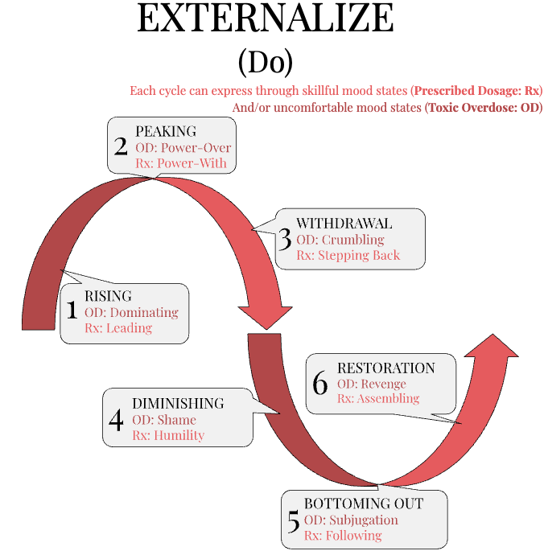

## Archetypal Gender: Masculine, Feminine, and Baphomet

Take a look at the spiral above and notice the pattern: warm colors alternate with cool ones as you move upward through the ten stages of APTITUDE. This isn’t just aesthetic—it maps an energetic rhythm. The warm tones represent the Divine Masculine:
assertive, agentic, outward-moving. The cool tones embody the Divine Feminine: receptive, intuitive, inward-facing. Each stage expresses one of these poles as part of a larger dialectic—doing and being, self-expressing and self-sacrificing, the “I” and the “We.”

This alternating pattern continues until the final two stages, where something shifts. Ultraviolet and Clear Light are no longer colored by polarity. Instead, they merge. These are the stages of Union and Emptiness, and they represent the integration of masculine and feminine into a single, transcendent whole—what mystics and esoteric traditions might call Hermaphroditic, or Baphomet energy.

In this section, we’ll explore the archetypal meaning of the Masculine, the Feminine, and what it means to walk a path that ultimately includes—and then dissolves—the binary altogether.

### Divine Masculine: I, Individual, Self-Expressing

The Divine Masculine, in the APTITUDE model, corresponds to the “I” stages of the spiral. These are the warm-colored waypoints: Beige, Red, Orange, and Yellow. Each one is concerned with the development of individual will, self-expression, and the capacity to move outward into the world with direction, clarity, and power.

Masculine energy here doesn’t mean “male” in a biological or social sense. It’s archetypal—referring to the impulse toward agency, assertion, and structure. This is the side of the spiral that acts on the world rather than absorbing it. It says, “I am.” It initiates. It hunts, builds, speaks, solves, challenges, protects, penetrates, and transforms.

In the Divine expression of the Masculine, this energy is not dominating or violent—it is aligned action. It is sacred fire. It is a sword that protects the innocent and cuts through illusion. It builds the temple. It asks hard questions. It holds boundaries.

Each of the four Masculine stages explores a different facet of this archetype:

- Beige builds foundational agency. It teaches us
  how to care for our physical needs and make ourselves trustworthy to our own nervous systems.

- Red discovers power. It awakens raw will, the
  ability to assert oneself, to say “No,” to claim space.

- Orange refines will into purpose, learning how to
  harness discipline, strategy, and achievement toward meaningful goals.

- Yellow lets go of egoic power and shifts toward
  wisdom-infused action—building and analyzing systems to be of service.

These are the self-expressing stages—the ones that push outward. They are the inhale. The muscle. The reach. They are necessary for growth, but not sufficient on their own. Without the balancing current of the Feminine, Masculine energy calcifies into domination, rigidity, or burnout.

But when integrated, the Divine Masculine becomes the part of you that can say, “I choose.” And mean it.

### Divine Feminine: We, Collective, Self-Sacraficing

The Divine Feminine flows through the cool-colored stages of APTITUDE: Purple, Blue, Green, and Teal. These are the “We” stages—archetypally receptive, relational, and self-sacrificing not in a codependent sense, but in the sacred recognition that we are part of something larger than ourselves.

Where the Masculine initiates, the Feminine invites.
Where the Masculine builds structure, the Feminine feels into what is true. It is the energy of listening, tending, harmonizing, healing, dreaming, and dissolving. It doesn’t rush toward a solution. It opens space for something deeper to emerge.

In the Divine Feminine, there is immense power—but it moves like water. It reshapes through persistence, nurtures without demanding credit, and holds paradox in its palms without needing to resolve it.

Each Feminine stage in APTITUDE explores a different mode of this sacred “We” energy:

- Purple teaches attunement to myth, emotion, and
  subtle signals. It opens our bodies and spirits to meaning that can only be received, never forced.

- Blue awakens love in its collective form—loyalty,
  duty, belonging, and service to shared ideals.

- Green turns that love inward and outward
  simultaneously, integrating the shadow, listening to the Other, and honoring every perspective.

- Teal dissolves personal identity in favor of
  alignment with Source, trusting intuition, channeling wisdom, and acting as a vessel for collective healing.

These are the self-sacrificing stages—the ones that allow ego to soften so communion can arise. They are the exhale. The womb. The stillness. The surrender. They teach us how to feel without flinching, to include without collapsing, to receive without grasping.

Without the Masculine, this current can become unmoored—passive, porous, or overly deferential. But when integrated, the Divine Feminine becomes the part of you that can say, “I trust.” And truly listen for the answer.

### The Story and Character of Baphomet

The Story and Character of Baphomet is one of the most misunderstood and misrepresented in the entire symbolic lexicon of the Western esoteric tradition. Often reduced to a satanic scarecrow in pop culture or demonized by those unfamiliar with its origins, Baphomet is not a figure of evil—it is a symbol of Wholeness.

Originally popularized in its current form by the 19th-century occultist Eliphas Levi, Baphomet is depicted as an androgynous, winged, goat-headed figure seated in meditative repose. One hand points up, the other down. The words Solve and Coagula—Latin for “dissolve” and “bind”—are inscribed on its arms. Breasts and phallus are both symbolically present. The figure is at once serene and wild, light and dark, male and female, human and animal.

Baphomet is the archetypal embodiment of integration. Every polarity reconciled. Every opposition held in balance. Its message is clear: Wholeness does not come from choosing a side—it comes from becoming the vessel that can hold them all.

In the context of APTITUDE, Baphomet is the symbolic guardian of the final two stages—Ultraviolet and Clear Light—where the dance between Masculine and Feminine finally transcends the binary.
These aren’t just “balanced” stages. They are nondual. Here, we no longer alternate between Yes and And, Self and Other, Agency and Receptivity. We become the rhythm itself.

Baphomet is the spiral made flesh. The paradox resolved by embodiment. The character who has walked the full arc of the story—from instinct to intuition, ego to emptiness—and now returns with the ability to be the thing that includes all things.

You might meet Baphomet when your masculinity softens into intuition. When your feminine receptivity anchors into decisive action. When your ideas about “good” and “evil” fall apart, and what’s left is something truer than morality: integration.

To live out the story of Baphomet is not to become something monstrous, but to become something impossibly whole. To wear your contradictions like jewels. To carry light and shadow in the same breath
