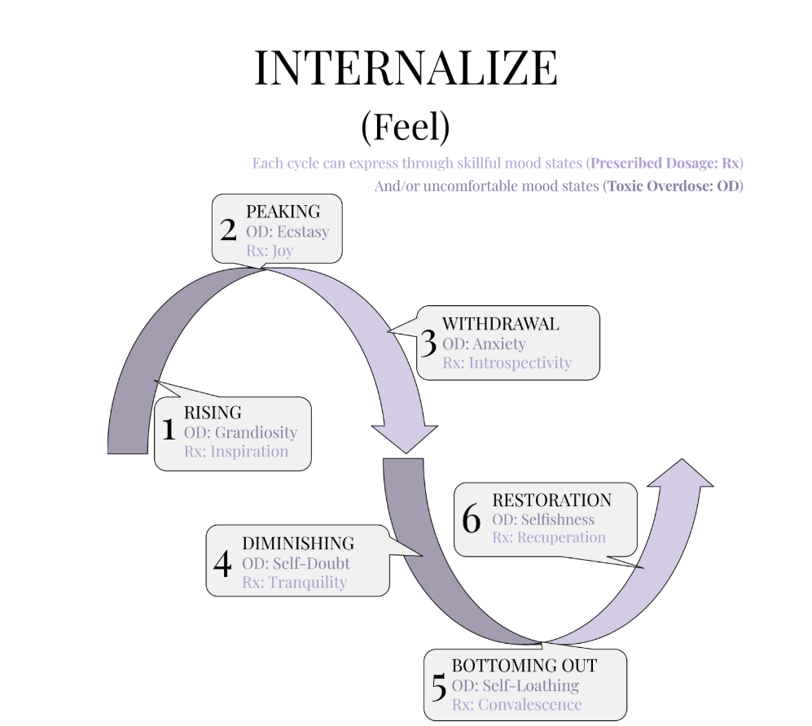

## “INHABIT (Feel)”

Approaching the Archetypal Wavelength from the perspective of Purple means shifting from Doing to Feeling. This is the Inhabit (Feel)
cycle—the Divine Feminine expression of Yes-And-Ness. If Beige is about stabilizing your life through embodied action and structure, Purple explores how we emotionally metabolize our experience. It's the part of the spiral where you're not building habits with your hands, you're weathering moods with your heart.

Like Beige, this Stage is internal—it's still about what happens inside of you, still mediated through your own perception and authority. But where Beige tracked the rhythm of physical action and the forging of foundational behaviors, Purple tracks the somatic rhythm of emotional states. It’s not about getting things done. It’s about being with what arises.

This Wavelength is Divine Feminine in nature—again, not in the sense of gender identity, but in archetypal function. It is receptive, intuitive, and emotionally intelligent. Instead of pushing forward, it draws inward. Instead of executing on decisions, it listens for signals. Purple teaches us how to feel our way through the wave rather than climb it.

You’ll see the same six-phase cycle—Rising, Peaking, Withdrawal, Diminishing, Bottoming Out, and Restoration—but each phase is now expressed as a mood state. And just like Beige, each phase can show up as either a Prescribed Dosage (Rx)—a balanced and skillful feeling—or a Toxic Overdose (OD)—a distortion of the same energy when it becomes excessive or unprocessed.

You don’t need to memorize the phases right now.
Just know that this internal Feel Wavelength will prepare you for later Stages that explore outward relational emotions (like Blue) and collective embodied emotions (like Teal). Each pair of Stages will walk you through the Wavelength’s pulse from a different perspective—one masculine, one feminine; one active, one receptive; one individual, one collective.

As always, you can reference the image gallery when needed. These graphics are designed to help you recognize where you are on the wave—not just intellectually, but emotionally. With this awareness, you can begin to soften your grip on moods when they surge, hold them gently as they pass through, and reclaim agency by feeling skillfully rather than reacting blindly.

The goal here isn’t to control your feelings.

It’s to befriend them.

### 1. RISING

- Rx: Inspiration
- OD: Grandiosity

Rising in the Inhabit (Feel) Wavelength is the soft ignition of emotional momentum. Something lights up inside you—a spark of curiosity, wonder, creative longing, or intuitive resonance. It might not be a full idea or plan yet, but it’s alive. You feel stirred. Energized. Slightly more radiant than usual.
Inspiration arrives as a whisper, a shimmer, a pull toward something meaningful.

This isn’t Beige’s grinding motivation or Red’s fierce determination. This is more like the breath before the song begins, or the lift of your chest as a story opens with promise. It’s subtle, but unmistakable. You start noticing beauty. Possibility. A desire to engage.

But the overdose of this phase—Grandiosity—can creep in fast if you’re ungrounded. That same flicker of inspiration can balloon into a conviction that you’ve uncovered something earth-shattering, that you are uniquely important, that the synchronicities you’re experiencing confirm a divine mission only you can fulfill. It can feel amazing. It can also pull you out of relationship with others and the ordinary world. Your sense of scale warps. You may lose discernment.

The work of Rising, then, is to let yourself feel lifted without floating away. Let yourself glow without needing to blaze. Inspiration wants to move through you—but not inflate you. Can you be the flute, not the fanfare?

When this phase is skillfully felt, it opens your heart. You reconnect to purpose. Your mood gently rises. You remember what it feels like to want something again.

Let that wanting guide you—but stay receptive. Stay humble. And remember: the wave hasn’t peaked yet. This is just the first swell.

### 2. PEAKING

- Rx: Joy
- OD: Ecstasy

Peaking in the Inhabit (Feel) Wavelength is the full bloom of the emotion that began in Rising. If Inspiration is the opening chord, Joy is the crescendo. You’re lit up. The colors feel richer, music hits deeper, and connection—whether with people, ideas, or the divine—feels effortless.
This is the apex of the wave’s vitality, where everything clicks and you feel aligned with something larger than yourself.

Joy, in this dosage, is clean. Present. Grounded. It’s not manic—it’s radiant. You’re not escaping from pain; you’re fully here, and it feels good. This kind of joy can be quiet or loud, solitary or shared, but it always carries that unmistakable feeling: this moment is enough.

But when the charge becomes too much to hold, when you chase that feeling or inflate it to escape discomfort, you tip into Ecstasy. Not the bliss of meditative stillness—this is the kind that overwhelms. The nervous system gets flooded. Your thoughts race. You feel too much meaning, too much truth, too much self. The high loses its clarity and becomes destabilizing.

Ecstasy, in this overdose form, disconnects you from integration. You become enchanted by the sensation itself and lose the thread of how it fits into the larger cycle. It’s a spiritual sugar rush, and the crash is coming.

The skill here is to savor the joy without grasping. Let it fill you, yes—but also let it move. Feel it fully and let it pass. Joy is not something to own—it’s something to be present with while it’s visiting.

You’ve reached the top of the emotional wave. There is nothing wrong with being here. Just don’t try to live here forever.

The beauty of Peaking is that it teaches you what’s possible. The wisdom of Peaking is knowing it won’t last.

### 3. WITHDRAWAL

- Rx: Introspectivity
- OD: Anxiety

Withdrawal in the Inhabit (Feel) cycle is the turning point—the subtle shift from expansion to contraction. After the high of Peaking, your system begins to pull inward. Energy recedes.
Sensations dull. What felt effortless begins to feel heavier, quieter, or more distant. This isn’t failure—it’s rhythm. The tide goes out.

When received skillfully, this phase becomes Introspectivity. You begin to reflect, to digest what just happened. Questions surface gently: What am I learning? What did that wave stir in me? You slow down. You journal. You walk without music. You feel your feelings instead of performing them. This is sacred pause.

But when this turning inward is resisted—or when you cling to the high and interpret its fading as a threat—it curdles into Anxiety. The loss of glow becomes a warning siren. You start scanning: What’s wrong with me? Why did it stop? Did I lose the magic? Your body may get tense. The mind loops. The beautiful thing you were feeling now feels suspicious, fleeting, or unsafe.

This is the phase where many people panic, especially if they don’t yet trust the Wavelength. But the key is to notice: you are not falling apart—you’re falling inward. This is where integration begins. The nervous system is shifting gears. You are still on the wave. You are still okay.

Let yourself turn inward. The clarity you’re looking for isn’t out there right now. It’s coming—but first you have to feel what’s here. Let go of the chase.

This is the part of the wave that teaches you to listen. Not for signs. Not for symbols. For yourself.

### 4. DIMINISHING

- Rx: Tranquility
- OD: Self-Doubt

Diminishing marks the descent into quiet. Energy recedes. Your inner world becomes less vibrant, less urgent. The brightness of Peaking fades into past tense, and with it, your need to perform begins to dissolve.
If you allow yourself to be receptive to this shift—if you don’t try to muscle through it with Beige-style Doing—you’re met with Tranquility. The soft glow of a world that no longer needs to impress you. The peace that arrives when effort is set down.

But if you meet this descent with resistance—if you yearn for the light that was, and grasp at the feeling you once had—you’re met not with peace, but with Self-Doubt. That’s the cost of treating a Feminine phase with Masculine energy. You start asking yourself whether you’ve lost it. Whether you ever had it. You feel like you should be doing more—even when the wave is telling you to do less.

This OD arises from wishing it were otherwise.

Through grasping at past Peaks, you deepen the valley that your energy is drawing you into. What might be a soft bed to lie down on becomes a pit that you plummet into. By denying that the descent is happening, you relegate it to the shadow, where it has no choice but to demand—with a screaming, stomping tantrum—that you listen.

That tantrum is what increases the dosage of Diminishing beyond Medicine and into Overdose.

If you reach backwards toward Peaking, you miss the medicine of Diminishing. But if you let yourself sink, gently, into the quiet, you may find that rest isn’t laziness—it’s wisdom. The next peak will come. It always does. But for now, you are being asked to receive the rest between notes.

The invitation is simple: soften. Rest. Feel the stillness. Let the tide pull back without trying to chase it.

### 5. BOTTOMING OUT

- Rx: Convalescence
- OD: Self-Loathing

Bottoming Out is not the enemy. It’s the compost heap of the soul—the place where the old breaks down to feed the new. When approached with Receptivity, this phase offers Convalescence: true recovery, deep stillness, a return to the baseline of being. It’s not a problem to be fixed. It’s not a flaw to be corrected. It’s an essential phase of your emotional rhythm.

But if you bring Peak expectations into this valley—if you demand clarity, vitality, creativity, or purpose—then this soft stillness warps into Self-Loathing. You start comparing your low to your previous high, and that contrast becomes unbearable. You feel broken, behind, defective. But the pain doesn’t come from the bottom. It comes from resisting the bottom. From wishing you were somewhere else.

The truth is, there is nothing wrong with being here. This is where healing happens, but only if you allow it. You are not meant to solve everything from this state. You are meant to surrender. To trust that nothing needs to be solved right now. Not your mood. Not your life. Not the whole goddamn world.

When you let go of striving and stop imagining you’re supposed to be better than this, the bottom becomes a sanctuary.
It holds you. It swaddles you. It lets you dissolve so you can be re-formed.

The only difference between agony and Convalescence is whether or not you accept that this is exactly where you’re supposed to be.

And if you can—that’s when the healing begins.

### 6. RESTORATION

- Rx: Recuperation
- OD: Selfishness

Restoration is the gentle turning point—the first warm breeze after a long emotional winter. If you’ve allowed yourself to Convalesce, truly and without resistance, this phase feels like a soft re-entry. You don’t spring to life; you stir. You start to Recuperate—to gather strength, to reintegrate sensation, to feel the world becoming colorful again.

This isn’t the high of Peaking. It’s the reanimation of presence. You smile at a tree. You return a message. You hear music and it moves you. There’s no urgency. There’s just the slow, safe return to aliveness.

But if the preceding phase—Bottoming Out—was navigated through Self-Loathing rather than Convalescence, then Restoration may be colored by fear. Having felt so raw and exposed, you may begin to hoard the little bit of energy you’ve reclaimed. You might become overly protective of your time, your insight, your joy. This is Selfishness—not as a moral flaw, but as a trauma reflex. A shield built out of the memory of despair.

It’s understandable. When you’ve been hollowed out by shame, the reappearance of vitality can feel fragile, precious, easily stolen. You may think: I can’t go back there. I need to protect what’s mine now. But that defensiveness can keep you isolated. The wound begins to dictate your next steps, and you mistake scarcity for safety.

The remedy isn’t to force openness. It’s to trust the wave. To remember that your energy will return again and again, as long as you honor its rhythm. Recuperation is not a rush to action—it’s an invitation to gently expand. To share a little. To rejoin the world in increments.

You don’t need to give everything. You just need to remember: this glow is yours, but it’s not your only one. And it grows stronger in connection.

Let yourself rise slowly. But don’t be afraid to rise.
