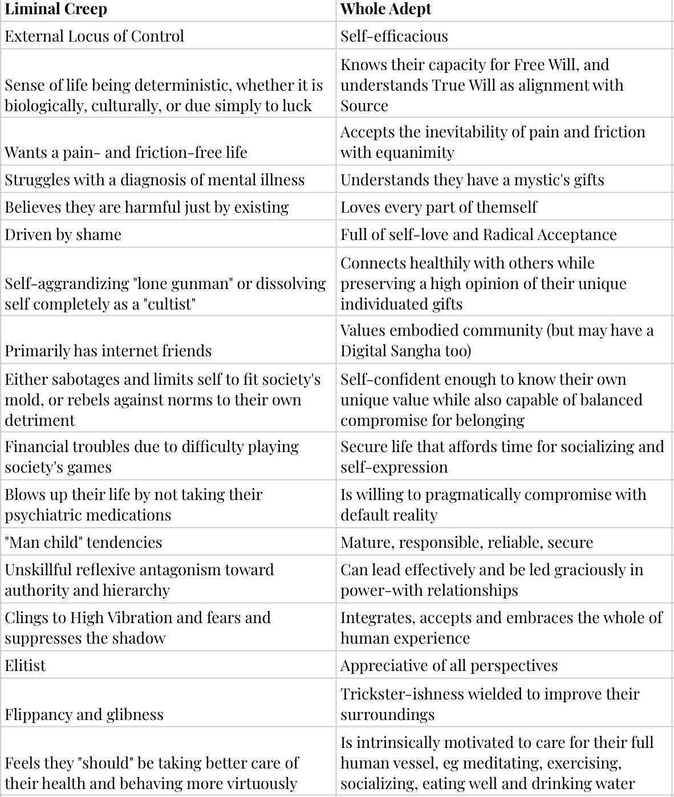

### From Liminal Creep to Whole Adept: Transformation Made Possible by APTITUDE

You know the [Creep archetype](https://creekmasons.com/p/im-a-creep). A touch of
loving self-deprecation inspired by [Radiohead](https://www.youtube.com/watch?v=XFkzRNyygfk), because I want to
”have the perfect body” and “perfect soul” so I can finally “belong
here.” You know this archetype—because you’ve
been the Creep.

The one whose insight is sharp enough to cut
themself on it, but whose life is a dull mess. The one who’s glimpsed
enlightenment at 3AM in a haze of nicotine and caffeine but who can’t
seem to hold a job. The one who either rails against the system or
dissolves, unable to convince themself that matter is what
matters.

The Liminal Creep knows they have a Buddha nature,
but sometimes forgets their social security number.

The Whole Adept, on the other hand, has integrated.
They are neither a guru nor a dropout, neither a zealot nor a nihilist.
They are awake
and effective. Mystical
and grounded. They are
in radical self-ownership, capable of playing
the game without the game playing them.

APTITUDE is the bridge between Creep and Adept. It
takes you from self-sabotage to self-mastery. From disempowered
rebellion to power-with,
from alienation to genuine belonging. It teaches you
how to swim in the mystical without drowning in
psychosis.

More than anything else, to me, Liminal Creeps
represent an untapped resource of—typically
neurodivergent—seekers who are ready to be
finders. Cast-aside shamans who I hope can
co-lead ourselves through the APTITUDE framework toward re-integration
with our meatspace communities. Because it’s only by being deeply
embedded in our physical communities that our awakened insights can be
of service to the
polycrisis—the
cascading emergencies we’re faced with as a civilization. For example,
the climate, political, inequality, loneliness, and meaning crises.

There are more. In fact, I’m sure you have one you
care about above all others. One that keeps you up at night. APTITUDE
aims to impart the internal resources that allow you to maximally impact
the issues that leave you most concerned.

After all, the list of crises goes on and on, and it
clearly demands that each of us contribute our unique
something. To
weave our one thread back into the tapestry
and help with the collective healing.

Join us!
